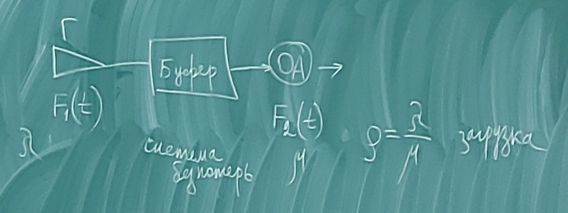
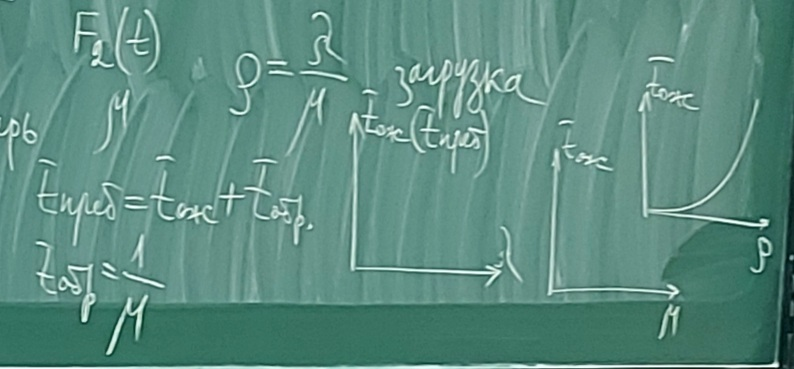

# Лекция 1

Загрузка характеризует систему.

Исходные данные задавать в терминах:
* интенсивности поступления заявок;
* интенсивности обслуживания заявок.

На выходе: среднее время ожидания или время пребывания в системе ($T_{преб.}=T_{ож.}+T_{обр.}$);

$T_{обр.}=1/\mu$

**Эксперимент** - система операций, воздействий и (или) наблюдений, направленных на получение информации об объекте в процессе исследовательских испытаниях.

**Опыт** - воспроизведение исследуемого явления в определенных условиях проведения эксперимента при возможности регистрации его результатов.

**План эксперимента** - совокупность данных, определяющих количество, условия и порядок реализации опытов.

**Планирование эксперимента** - выбор плана эксперимента, удовлетворяющего заданным требованиям.

**Фактор** (ндп. Параметр) - переменная величина, по предположению влияющая на результаты эксперимента.

**Уровень фактора** - фиксированное значение фактора относительно начала отсчета.

**Основной уровень фактора** - натуральное значение фактора, которому соответствует  нулевое значение в безразмерной шкале (нормированное значение).

**Нормализация факторов** - преобразование натуральных значений факторов в безразмерные величины.

**Априорное ранжирование факторов** - метод выбора наиболее важных факторов, основанный на экспертной оценке.

**Размах варьирования фактора** - разность между максимальным и минимальным натуральными значениями фактора в данном плане.

**Интервал варьирования фактора** - половина размаха варьирования фактора.

**Эффект взаимодействия факторов** - показатель зависимости изменения эффекта одного фактора от уровней других факторов.

**Факторное пространство** - пространство, в котором координатные оси соответствуют значениям факторов.

**Область экспериментирования** (область планирования) - область факторного пространства, где могут размещаться точки, отвечающие условиям проведения опытов.

**Активный эксперимент** - эксперимент, в котором уровни факторов в каждом опыте задаются исследователем.

**Пассивный эксперимент** - эксперимент, в котором уровни факторов в каждом опыте регистрируются исследователем, но не задаются.

**Последовательный эксперимент** (ндп. шаговый эксперимент) - эксперимент, реализуемый в виде серий опытов, в котором условия проведения каждой последующей серии опытов определяются результатами предыдущих.

**Отклик** (ндп. Реакция на Параметр ) - наблюдаемая случайная переменная, по предположению, зависящая от факторов.

**Функция отклика** - зависимость математического ожидания отклика от факторов.

**Оценка функции отклика** - зависимость, получаемая при подстановке в функцию отклика оценок значений ее параметров (зависимость функции отклика от ее параметров).

**Дисперсия оценки функции отклика** - дисперсия оценки математического ожидания отклика в некоторой данной точке факторного пространства.

**Поверхность отклика** (ндп. Поверхность регрессии) - геометрическое представление функции отклика.

**Поверхность уровня функции отклика** - геометрическое место точек в факторном пространстве, которому соответствует некоторое фиксированное значение функции отклика.

**Область оптимума** - область факторного пространства в окрестности точки, в которой функция отклика достигает экстремального значения.

**Рандомизация плана** - прием планирования эксперимента, цель которого свести эффект некоторого неслучайного фактора к случайной ошибке.

**Параллельные опыты** - рандомизированные во времени опыты, в которых уровни всех факторов сохраняются неизменными.

**Исследователь на этапе планирования эксперимента должен дать ответы на следующие вопросы:**

* к какому классу относится моделируемая система (статическая или динамическая, детерминированная или стохастическая и т.д.);
* какой режим работы его интересует, стационарный (установившийся) или нестационарный;
* в течение какого промежутка времени следует наблюдать за поведением (функционированием ) системы;
* какой объём испытаний (то есть повторных экспериментов) сможет обеспечить требуемую точность оценок (в статистическом смысле) исследуемых характеристик системы.
