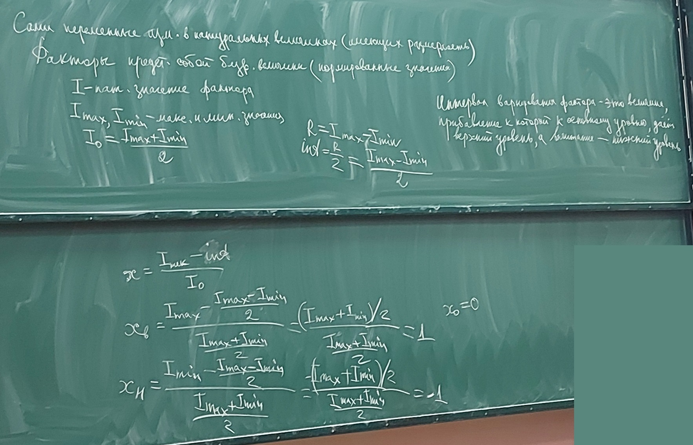

# Лекция 2 (16.02.2023)

$\rho$ - загрузка = $\Large \frac{\text{Интервал времени в теч. которого обр. заявки}}{\text{Общее время моделирования}}$

$\large t_{зан}=N \cdot T_{обр}$

$\large N=\lambda \cdot T$ - теорема Литтла

$\large \rho = lim_{T \to \infty} \frac{\lambda T \cdot T_{обр}}{T}=\lambda \cdot T_{обр}=\frac{\lambda}{\mu}$

$\large T_{обр.}=\frac{\lambda}{\mu}$

## Цель пассивного эксперимента

1. Сокращение количества опытов при обеспечении требуемой точности и достоверности результатов;
2. Повышение информативности каждого из опытов. Опыты проводят в факторном пространстве. Факторное пространство – множество внутренних и внешних  факторов, значения которых исследователь задает в процессе проведения  актов.

